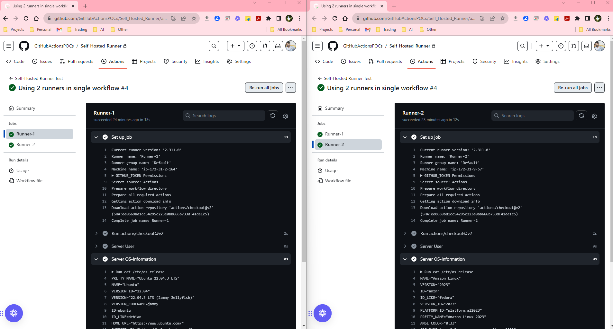

# Using 2 Self-Hosted Runner's in GitHub Actions Worflow

## Configuring a Self-Hosted Runner Process
- Downloading GitHub Runner with Right Runner Image and its Architecture

- Configuring GitHub Runner to connect with GitHub Account

#### Note: 
- Install libicu package in Redhat/Fedora/AmazonLinux2 `sudo yum install libicu -y`
- The token will be unique w.r.t Runner/Repo(Image shown Token will be dummy to you)

### Configuring Best Practices
- Always give a name to your runner
- Always give a label(tag) to your runner

## Using a Self-Hosted Runners in Workflow
- Create a sample workflow in repo having
  - 2 Runners [ Runner-1. Runner-2 ]
  - Each checking Server User, Server OS-Information Server Public Address
- Worflow content will be as in `workflow.yaml` file in `.github/workflows` folder

## Testing/Verification of Workflow Run
 - A worflow will start with 2 jobs;

 

 - We can check each runner runner information and their ouputs;

  

 - We can also check each job/runner status on server;
 
 

----
## Ignore React app contents in this repo for now; this might helpful in other POC/repos for testing

## React App 
- Install Node
- Commands
  - `npm i`
  - `npm run start`
- These 2 commands, will start the react app in local at `localhost:3000`

#### References:
- About self-hosted runners. [Here](https://docs.github.com/en/actions/hosting-your-own-runners/managing-self-hosted-runners/about-self-hosted-runners)
- To add a self-hosted runner. [Here](https://docs.github.com/en/actions/hosting-your-own-runners/managing-self-hosted-runners/adding-self-hosted-runners)
- To Use multiple runners in workflows. [Here](https://docs.github.com/en/github-ae@latest/actions/hosting-your-own-runners/managing-self-hosted-runners/using-self-hosted-runners-in-a-workflow#using-default-labels-to-route-jobs)
- To Use Docker/Kubernested as a runner. [Here](https://youtu.be/RcHGqCBofvw?si=4M9Msi6oxfrLEhR9)

